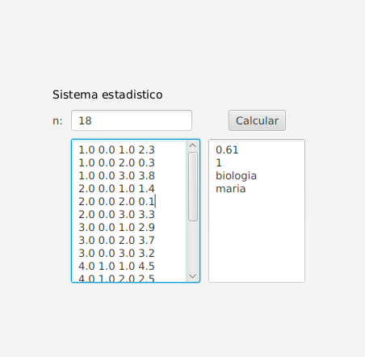

# **Reto 3.10**
**Nombre de reto:** Diseño de sistema estadístico para escuela.
## Descripción del reto
Una escuela primaria desea implementar un sistema estadístico de clasificación denotas de los exámenes de sus estudiantes.
La escuela utiliza un sistema de notas basado en números que van desde el 0 hasta el5, con diferentes rangos con labels que enfatizan el desempeño de los estudiantes. El sistema debe generar datos estadísticos que puedan ayudar a los profesores aidentificar   grupos   o   estudiantes   con   dificultades.  Actualmente   se   cuenta   con   lainformación de las calificaciones de los exámenes para cada uno de los estudiantes dela clase F, el sistema debe generar los datos estadísticos a partir de los siguienteinformación:

|**Nombre**|**Genero**|**Materia**|**Nota**|
|--|--|--|--|
|alexandra|f|matematicas|4.1|
|daniel|m|matematicas|4.6|
|alexandra|f|idiomas|3.5|
|daniel|m|idiomas|3.4|

Las calificaciones en la escuela se asignan con la siguiente escala de rangos:
|**Rango de notas**|**Calificación**|
|--|--|
|(4.5 - 5]|Excelente|
|(3.5 - 4.5]|Sobresaliente|
|(2.5 - 3.5]|Regular|
|(1 - 2.5]|Insuficiente|
|[0 - 1]|Deficiente|

El algoritmo debe ser capaz de responder a las siguientes preguntas:
- ¿Cuál es el desempeño promedio de todo el grupo?
- ¿Cuántos exámenes tienen una calificación Regular?
- ¿Cuál   es   la   materia   con   el   peor   desempeño   promedio   para   el  géneromasculino?
- ¿Cuál es el estudiante con el mejor desempeño para la materia historia?

## **Ejemplo**
Para facilitar el proceso de ingreso y manipulación de los datos, los valores de tipostring se les asignará un identificador numérico único por categorías:
|**Nombre**|**Identificador**|
|--|--|
|armando|1|
|nicolas|2|
|daniel|3|
|maria|4|
|marcela|5|
|alexandra|6|

|**Materia**|**Identificador**|
|--|--|
|historia|1|
|literatura|2|
|biologia|3|

|**Género**|**Identificador**|
|--|--|
|m|0|
|f|1|

|**ENTRADAS DE PRUEBA**|
|--|
|18|
|1.0 0.0 1.0 4.8|
|1.0 0.0 2.0 1.8|
|1.0 0.0 3.0 3.9|
|2.0 0.0 1.0 2.8|
|2.0 0.0 2.0 2.4|
|2.0 0.0 3.0 0.0|
|3.0 0.0 1.0 1.1|
|3.0 0.0 2.0 0.4|
|3.0 0.0 3.0 2.1|
|4.0 1.0 1.0 0.3|
|4.0 1.0 2.0 3.0|
|4.0 1.0 3.0 1.5|
|5.0 1.0 1.0 1.1|
|5.0 1.0 2.0 4.9|
|5.0 1.0 3.0 0.5|
|6.0 1.0 1.0 0.7|
|6.0 1.0 2.0 2.0|
|6.0 1.0 3.0 0.4|

|**SALIDA ESPERADA**|
|--|
|1.87|
|2|
|literatura|
|armando|

Otro aspecto importante es el formato de entrada de los datos, la primera línea de laentrada se trata del número de registros que se deben leer. Las líneas de los registrostienen un formato de tabla, el orden de las columnas es: nombre, género, materia ycalificación, las columnas están separadas por un espacio. Se recomienda copiar y pegar este ejemplo en la terminal para realizar pruebas.     
***
## **FASE 3**
Para esta fase del proyecto se requieren construir dos proyectos de software:

1. **Sistema de calificación basado en consola/terminal:**    
Este sistema se caracteriza por requerir el uso de la **herencia** en programación orientada a objetos, además la entrada del programa será insertada de la misma forma que se realizó en las fases anteriores. Los requerimientos funcionales de este proyecto son los siguientes.
  
   - Se debe implementar una clase padre la cual debe llevar el nombre **GradingSystem**, esta clase tiene la siguiente estructura:
      - Contiene cuatro métodos cada uno llamado stat#, donde # corresponde al resultado de la operación requerida por el sistema, para este caso se trata de las 4 preguntas presentes en el enunciado.
      - Estos métodos pueden recibir el número de parámetros que usted decida.
      - Al igual que la fase anterior estos métodos deben retornar la respuesta a las preguntas requeridas.
      - Todos los cálculos y operaciones referentes a las cuatro preguntas deben realizarse dentro de esta clase.
   - Se debe implementar una clase hijo llamada **SchoolGradingSystem**, esta clase debe ser hija de la clase **GradingSystem**. La estructura de esta clase es la siguiente:
      - Se debe extender la funcionalidad de la clase padre con una implementación particular del método loadData, este método debe leer la información suministrada.
      - Este método puede o no llevar parámetros de entrada.
   - Por último se debe implementar una clase llamada **App**, esta clase debe contener un método main, en el cual se debe instanciar un objeto de tipo **SchoolGradingSystem** y se deben ejecutar los métodos para mostrar la salida en el formato requerido.
2. **Sistema de calificación por GUI:**    
Este sistema se caracteriza por hacer uso de los paquetes de JavaFX para el diseño de una interfaz gráfica. Este proyecto ofrece una nueva experiencia de usuario permitiendo desplegar la información de forma más amigable para personas no especializadas. Lo que se requiere para este proyecto es lo siguiente:
   - Se debe hacer uso de la clase padre **GradingSystem** que se implementó en el proyecto anterior.
      - Se debe definir una clase hija la cual extiende la funcionalidad de la clase padre.
      - El diseño de esta clase hija es libre y se pueden definir los métodos que se deseen.
   - Se debe crear una clase primaria la cual es donde se debe ejecutar la aplicación y donde las clase definidas interactúan con la interfaz gráfica.
   - La interfaz gráfica debe ser una ventana en la cual se puedan ingresar los datos de entrada de la aplicación y se desplieguen los resultados.
   - Los requerimientos de la interfaz gráfica son los siguientes:
      - Se deben usar los elementos: Label, TexField, TextArea y Button.
      - Se sugiere el siguiente diseño en el cual se debe ingresar el número de registros que se van a ingresar en un TextField, los datos se ingresan en el TextArea izquierdo y en el TextArea derecho se muestran los resultados al presionar el botón calcular.   

**Notas:**
- Los datos presentes en la imagen de ejemplo son de demostración y no muestran resultados referentes a este enunciado en específico.
- Trabajar cada proyecto de forma independiente.
- Es importante seleccionar los tipos adecuados para cada método, ya que esto puede generar errores a la hora de calificar.
- Prestar especial cuidado a las notaciones de los rangos.
- Se considera aprobado a una calificación igual o mayor a Regular.
- Los elementos con un identificador menor tienen prioridad, al ejecutar un proceso y este arroja varios posibles resultados, se debe imprimir el que tenga menor identificador.

