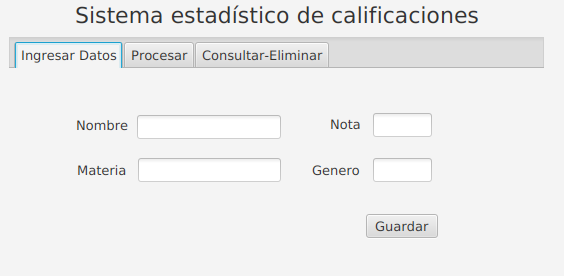
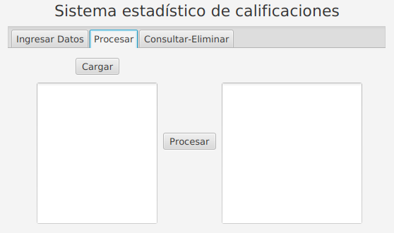
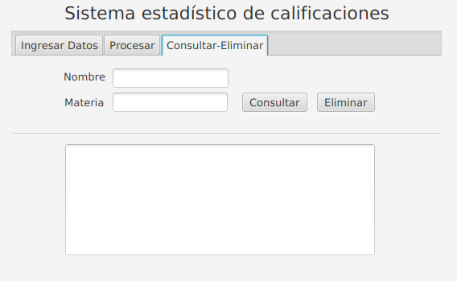

# **Reto 4.10**
**Nombre de reto:** Diseño de sistema estadístico para escuela.
## Descripción del reto
Una escuela primaria desea implementar un sistema estadístico de clasificación denotas de los exámenes de sus estudiantes.
La escuela utiliza un sistema de notas basado en números que van desde el 0 hasta el5, con diferentes rangos con labels que enfatizan el desempeño de los estudiantes. El sistema debe generar datos estadísticos que puedan ayudar a los profesores aidentificar   grupos   o   estudiantes   con   dificultades.  Actualmente   se   cuenta   con   lainformación de las calificaciones de los exámenes para cada uno de los estudiantes dela clase F, el sistema debe generar los datos estadísticos a partir de los siguienteinformación:

|**Nombre**|**Genero**|**Materia**|**Nota**|
|--|--|--|--|
|alexandra|f|matematicas|4.1|
|daniel|m|matematicas|4.6|
|alexandra|f|idiomas|3.5|
|daniel|m|idiomas|3.4|

Las calificaciones en la escuela se asignan con la siguiente escala de rangos:
|**Rango de notas**|**Calificación**|
|--|--|
|(4.5 - 5]|Excelente|
|(3.5 - 4.5]|Sobresaliente|
|(2.5 - 3.5]|Regular|
|(1 - 2.5]|Insuficiente|
|[0 - 1]|Deficiente|

El algoritmo debe ser capaz de responder a las siguientes preguntas:
- ¿Cuál es el desempeño promedio de todo el grupo?
- ¿Cuántos exámenes tienen una calificación Regular?
- ¿Cuál   es   la   materia   con   el   peor   desempeño   promedio   para   el  géneromasculino?
- ¿Cuál es el estudiante con el mejor desempeño para la materia historia?

## **Ejemplo**
Para facilitar el proceso de ingreso y manipulación de los datos, los valores de tipostring se les asignará un identificador numérico único por categorías:
|**Nombre**|**Identificador**|
|--|--|
|armando|1|
|nicolas|2|
|daniel|3|
|maria|4|
|marcela|5|
|alexandra|6|

|**Materia**|**Identificador**|
|--|--|
|historia|1|
|literatura|2|
|biologia|3|

|**Género**|**Identificador**|
|--|--|
|m|0|
|f|1|

|**ENTRADAS DE PRUEBA**|
|--|
|18|
|1.0 0.0 1.0 4.8|
|1.0 0.0 2.0 1.8|
|1.0 0.0 3.0 3.9|
|2.0 0.0 1.0 2.8|
|2.0 0.0 2.0 2.4|
|2.0 0.0 3.0 0.0|
|3.0 0.0 1.0 1.1|
|3.0 0.0 2.0 0.4|
|3.0 0.0 3.0 2.1|
|4.0 1.0 1.0 0.3|
|4.0 1.0 2.0 3.0|
|4.0 1.0 3.0 1.5|
|5.0 1.0 1.0 1.1|
|5.0 1.0 2.0 4.9|
|5.0 1.0 3.0 0.5|
|6.0 1.0 1.0 0.7|
|6.0 1.0 2.0 2.0|
|6.0 1.0 3.0 0.4|

|**SALIDA ESPERADA**|
|--|
|1.87|
|2|
|literatura|
|armando|

Otro aspecto importante es el formato de entrada de los datos, la primera línea de laentrada se trata del número de registros que se deben leer. Las líneas de los registrostienen un formato de tabla, el orden de las columnas es: nombre, género, materia ycalificación, las columnas están separadas por un espacio. Se recomienda copiar y pegar este ejemplo en la terminal para realizar pruebas.     
***
## **FASE 4**
Para esta fase se continuará el trabajo realizado en la fase anterior, esta vez se debe integrar la interfaz gráfica con una base de datos relacional. Los requerimientos específicos de esta fase son los siguientes:

- Se debe implementar una base de datos en SQLite, esta base de datos debe contener una tabla en la cual se va a almacenar los datos requeridos como entrada en el enunciado.
- Se debe crear una interfaz gráfica la cual contenga los siguientes módulos:
   - **Módulo de entrada de datos:** Este módulo debe poder ingresar los datos en base de datos. Los datos requeridos son los siguientes: Nombre, Nota, Género y Materia.
   
   - **Módulo de procesamiento de datos:** El objetivo de este módulo es a partir de la información en base de datos realizar las operaciones estadísticas requeridas, se debe traer los datos de la base de datos y desplegarlos en el formato requerido en el TextArea de la izquierda, al presionar el botón procesar se deben hacer los cálculos y operaciones requeridas para obtener las respuestas que serán desplegadas en el TextArea de la derecha.
      
   El formato de entrada en este módulo es el mismo que se trabajó en las fases anteriores.
  
   - **Módulo para consultar, y eliminar datos:** Este módulo cumple el objetivo de realizar operaciones sobre los registros de la base de datos. Se deben proveer al usuario dos posibles acciones: Consulta de los datos a partir de ya sea el nombre del estudiante o la materia, se deben desplegar los registros de la base datos los cuales cumplen con, **por ejemplo** *si se se provee el nombre camilo se deben desplegar todos los registros de la base datos en los cuales el nombre es camilo*, por otro lado si se consulta por materia y se ingresa la materia Geografía, se deben desplegar los registros en los cuales la materia es geografía. La otra acción es la de eliminar registros, si se ingresa un nombre o una materia se deben eliminar todos los registros de la base de datos, los cuales contienen el dato requerido.
      
   Las consultas y eliminaciones se deben hacer con una de las dos posibles opciones ya sea por Nombre o por Materia. Si no existe ningún registro que coincida con la información ingresada, se debe desplegar un texto que diga que no se encontraron resultados.

**Notas:**
- Se recomienda reutilizar el código de las fases anteriores, en donde sea posible.
- Los datos presentes en la imagen de ejemplo son de demostración y no muestran resultados referentes a este enunciado en específico. 
- Trabajar cada proyecto de forma independiente.
- Es importante seleccionar los tipos adecuados para cada método, ya que esto puede generar errores a la hora de calificar.
- Prestar especial cuidado a las notaciones de los rangos.
- Se considera aprobado a una calificación igual o mayor a Regular.
- Los elementos con un identificador menor tienen prioridad, al ejecutar un proceso y este arroja varios posibles resultados, se debe imprimir el que tenga menor identificador.

